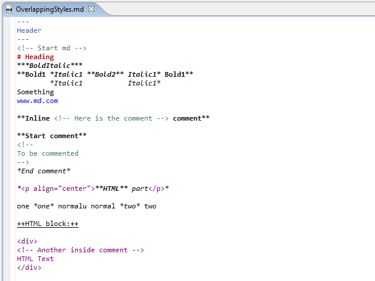
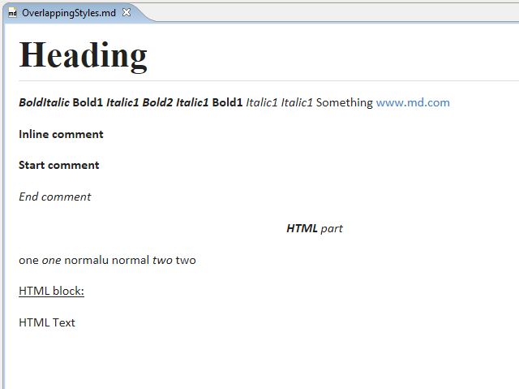

---
Markdown Semantic Eclipse Plug-in - (c) 2017 markdownsemanticep.org
---

# 
Markdown Semantic Eclipse Plug-in

| [Home](index.html) || [Screenshots](screenshots.html) || [Code](https://github.com/iuscl-ide/MarkdownSemanticEP) |
***

## 
Screenshots

Overlapping styles syntax highligh:

Overlapping styles rendering display:

***

| Website hosted by  || &copy; 2017 <a href="http://markdownsemanticep.org">markdownsemanticep.org</a> |
